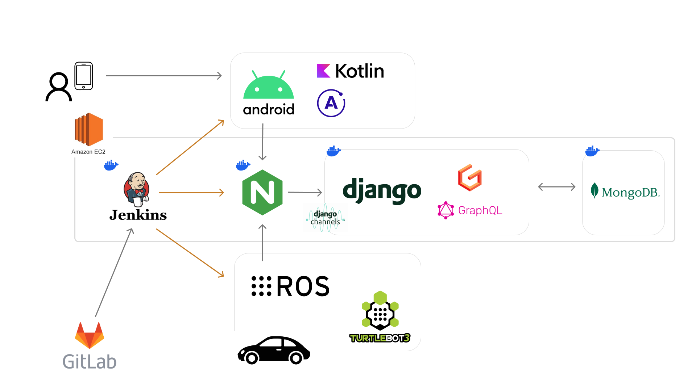

<b>“미래를 선도하는 차량 시스템”</b>

## :clipboard: 개요
"미래를 선도하는 차량 시스템"

- 개발 기간 : 2023. 10. 9. ~ 2023. 11. 17.
- 참여 인원 : 6인

## 💡 핵심 기능
- 차량 자율 주행 및 주차
- 차량 호출
- 차량 상태 원격 확인

## 🎬 UCC 영상

## 📆 제작 기간 및 인원
제작 기간 : 2023. 10. 9. ~ 2023. 11. 17. (6주)  
참여 인원 : 6인
|||||||
|:--:|:--:|:--:|:--:|:--:|:--:|
|<a href="">안희준(팀장)</a>|<a href="">강병선</a>|<a href="">서준희</a>|<a href="">신예리</a>|<a href="">최현준</a>|<a href="">황재천</a>
|ROS 세팅   터틀봇 통신|Backend   CI/CD|Backend   CI/CD   App|제어 알고리즘|제어/인지 알고리즘|인지 알고리즘   터틀봇 통신|

## 💻 기술 스택

 

### Backend

### Application

### Turtlebot
 
 

### CI/CD

### Server

<!-- ## 🔎 시연 영상

    <h3>1</h3>
    <h3>2</h3>
    <h3>3</h3>
    <h3>4</h3>
    <h3>5</h3>
    <h3>6</h3>
    <h3>7</h3>

 -->
